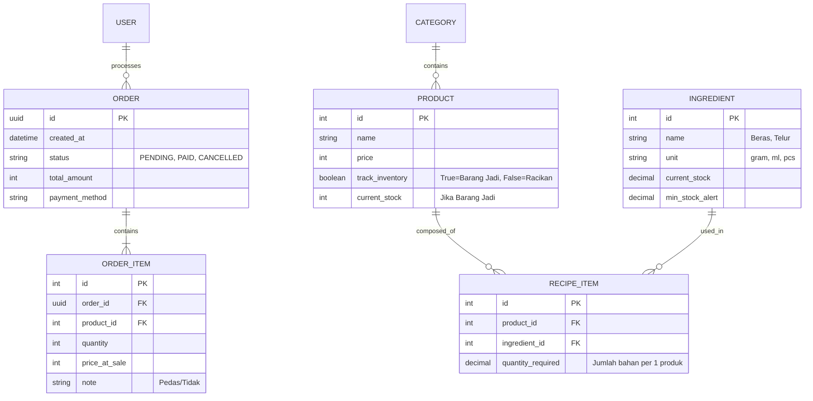

# Blueprint: CloudPOS (FnB Management System)

## 1. Executive Summary

**CloudPOS** adalah sistem kasir berbasis web (PWA) yang dirancang untuk bisnis F&B (Warung Makan/Restoran). Sistem ini menyatukan operasional kasir (POS) dan manajemen gudang (Inventory) dalam satu platform yang responsif.

**Core Capabilities:**

1. **Universal POS:** Web app yang responsif. Tampilan berubah otomatis antara mode Mobile (HP) dan mode Tablet (Split View).
2. **Smart Inventory:** Manajemen stok dua lapis: Stok Produk Jadi (Kaleng/Botol) dan Stok Bahan Baku (Resep/Composite).
3. **Offline-Capable:** Menggunakan Service Workers (PWA) untuk caching aset statis agar aplikasi cepat diakses di jaringan yang tidak stabil.

---

## 2. Tech Stack Architecture

### A. Frontend (Client)

* **Framework:** Next.js 14+ (App Router).
* **Language:** TypeScript (Strict Mode).
* **Styling:** Tailwind CSS + Shadcn/UI (Component Library).
* **State Management:** Zustand (Global Store untuk Cart & Session).
* **PWA:** `next-pwa` (Manifest & Service Worker).
* **Printing:** `react-to-print` (Browser Print) & URI Scheme `rawbt:` (Android Direct Print).

### B. Backend (Server)

* **Framework:** Django + Django REST Framework (DRF).
* **Database:** PostgreSQL.
* **Task Queue:** Celery + Redis (Untuk proses pengurangan stok yang berat agar tidak memblokir UI Kasir).
* **Architecture Pattern:** Service Layer Pattern (Memisahkan Business Logic dari Views).

---

## 3. Database Schema (Entity Relationship)

Menggunakan struktur relasional untuk menangani resep yang kompleks.




## 4. Backend Architecture (Clean Code & Service Layer)

Untuk menjaga kode tetap bersih, kita **dilarang** menulis logika bisnis di `views.py`. Gunakan `services.py`.

### Folder Structure (Django)

**Plaintext**

```
apps/api/
├── core/                   # Utilities, Abstract Models
├── users/                  # Auth Management
├── catalog/                # Products & Categories
├── inventory/              # Ingredients & Stock Logic
│   ├── models.py
│   ├── services.py         <-- LOGIC PENGURANGAN STOK DISINI
│   ├── selectors.py        <-- COMPLEX QUERIES DISINI
│   └── views.py            <-- HANYA MENERIMA REQUEST
├── sales/                  # Orders & Payments
└── manage.py
```

### Business Logic Example: Stock Deduction

Logika pengurangan stok (Inventory Service) harus menangani dua tipe produk:

**Python**

```
# apps/api/inventory/services.py
from django.db import transaction
from apps.api.catalog.models import Product
from apps.api.inventory.models import Ingredient, StockLog

@transaction.atomic
def deduct_stock_for_order(order_items: list) -> None:
    """
    Service ini dipanggil setelah pembayaran sukses.
    """
    for item in order_items:
        product = item.product
        qty_sold = item.quantity

        # Kasus A: Produk Barang Jadi (Misal: Kerupuk)
        if product.track_inventory:
            product.current_stock -= qty_sold
            product.save()
            _log_stock_movement(product, -qty_sold, "SALES")

        # Kasus B: Produk Racikan (Misal: Nasi Goreng)
        else:
            recipes = product.recipe_items.all()
            for recipe in recipes:
                ingredient = recipe.ingredient
                usage_amount = recipe.quantity_required * qty_sold
              
                ingredient.current_stock -= usage_amount
                ingredient.save()
                _log_stock_movement(ingredient, -usage_amount, "SALES_RECIPE")

def _log_stock_movement(item, qty, reason):
    # Internal helper to create log entry
    pass
```

---

## 5. API Design & JSON Responses

Berikut adalah kontrak data antara Frontend Next.js dan Backend Django.

### A. Endpoint: Get Product List (POS Menu)

Digunakan oleh aplikasi kasir untuk menampilkan menu.

* **URL:** `GET /api/v1/catalog/products/`
* **Query Params:** `?category=makanan&available=true`

**JSON Response:**

**JSON**

```
{
  "status": "success",
  "data": [
    {
      "id": 101,
      "name": "Nasi Goreng Spesial",
      "price": 25000,
      "image_url": "https://cdn.../nasgor.jpg",
      "category": "Makanan Berat",
      "stock_status": {
        "is_tracked": false, 
        "available": true // Backend otomatis cek stok bahan baku cukup/tidak
      }
    },
    {
      "id": 205,
      "name": "Teh Botol",
      "price": 5000,
      "image_url": "https://cdn.../teh.jpg",
      "stock_status": {
        "is_tracked": true,
        "remaining": 24 // Stok barang jadi
      }
    }
  ]
}
```

### B. Endpoint: Create Order (Checkout)

Dikirim saat kasir menekan tombol "Bayar".

* **URL:** `POST /api/v1/sales/orders/`

**Request Body:**

**JSON**

```
{
  "payment_method": "CASH",
  "total_amount": 30000,
  "items": [
    {
      "product_id": 101,
      "quantity": 1,
      "note": "Pedas banget"
    },
    {
      "product_id": 205,
      "quantity": 1,
      "note": "Dingin"
    }
  ]
}
```

**JSON Response (Success):**

**JSON**

```
{
  "status": "success",
  "data": {
    "order_id": "a1b2-c3d4-e5f6",
    "invoice_number": "INV/2026/01/29/001",
    "created_at": "2026-01-29T14:30:00Z",
    "status": "PAID"
  },
  "message": "Order processed and stock deducted."
}
```

### C. Endpoint: Ingredient List (Admin Inventory)

Untuk dashboard owner memantau bahan baku.

* **URL:** `GET /api/v1/inventory/ingredients/`

**JSON Response:**

**JSON**

```
{
  "data": [
    {
      "id": 5,
      "name": "Beras Putih",
      "unit": "gram",
      "current_stock": 25000.00, // 25 Kg
      "low_stock_alert": 5000.00,
      "status": "SAFE" // SAFE | LOW | CRITICAL
    },
    {
      "id": 8,
      "name": "Telur Ayam",
      "unit": "pcs",
      "current_stock": 4.00,
      "low_stock_alert": 10.00,
      "status": "LOW" // Frontend akan warnai Merah
    }
  ]
}
```

---

## 6. Frontend Architecture (Next.js)

Struktur folder dirancang untuk memisahkan **POS View** (Kasir) dan **Admin View** (Owner).

**Plaintext**

```
apps/web/
├── public/
│   ├── manifest.json       <-- Config PWA
│   └── sw.js               <-- Service Worker
├── src/
│   ├── app/
│   │   ├── (auth)/         <-- Login Page
│   │   ├── (pos)/          <-- Layout Fullscreen (No Sidebar)
│   │   │   └── cashier/
│   │   │       ├── page.tsx
│   │   │       └── components/
│   │   │           ├── ProductGrid.tsx
│   │   │           ├── CartSheet.tsx
│   │   │           └── ReceiptPrint.tsx
│   │   └── (admin)/        <-- Layout Dashboard (With Sidebar)
│   │       ├── inventory/
│   │       │   └── ingredients/page.tsx
│   │       ├── products/
│   │       │   └── recipes/page.tsx
│   │       └── reports/page.tsx
│   ├── hooks/
│   │   ├── useCart.ts      <-- Zustand Store
│   │   └── usePrinter.ts   <-- Logic Web Bluetooth / RawBT
│   ├── lib/
│   │   ├── api.ts          <-- Axios Instance
│   │   └── formatters.ts   <-- Format Rupiah
│   └── types/
│       └── api.d.ts        <-- Interface TypeScript (sesuai JSON diatas)
```

---

## 7. Responsive UI & PWA Strategy

### Breakpoints Logic (Tailwind)

Kita menggunakan pendekatan  *Mobile-First* .

**TypeScript**

```
// components/pos/ProductGrid.tsx
export function ProductGrid() {
  return (
    <div className="grid grid-cols-2 gap-2 md:grid-cols-3 lg:grid-cols-4 xl:grid-cols-5">
      {/* - HP (default): 2 Kolom 
         - Tablet Portrait (md): 3 Kolom
         - Tablet Landscape (lg): 4 Kolom
      */}
      {products.map(p => <ProductCard key={p.id} data={p} />)}
    </div>
  )
}
```

### Printing Strategy (Web)

Untuk memastikan kompatibilitas cetak:

1. **Component:** Buat komponen struk (`ReceiptTemplate.tsx`) dengan lebar `58mm` atau `80mm`.
2. **CSS:** Gunakan `@media print` untuk menyembunyikan elemen UI lain saat print dialog muncul.
3. **Android Integration:** Jika browser print gagal, gunakan tautan intent RawBT:
   **TypeScript**

   ```
   const printViaRawBT = (base64Receipt: string) => {
     window.location.href = `rawbt:data:image/png;base64,${base64Receipt}`;
   }
   ```

---

## 8. Development Phases

### Phase 1: Core Catalog & POS UI

* Setup Django & Next.js.
* Buat Master Data Produk.
* Buat UI Kasir (Product Grid & Cart).
* **Goal:** Bisa input pesanan dan melihat total harga.

### Phase 2: Transaction & Receipt

* Implementasi API `POST /orders`.
* Integrasi Printer (Browser Print).
* **Goal:** Transaksi tersimpan di DB dan struk tercetak.

### Phase 3: Inventory Logic

* Buat Master Bahan Baku & Resep.
* Implementasi `inventory/services.py` untuk pengurangan stok otomatis.
* **Goal:** Stok berkurang otomatis saat ada penjualan.

### Phase 4: Reporting & Dashboard

* Buat halaman Laporan Penjualan Harian.
* Buat halaman Monitoring Stok (Low Stock Alert).
* **Goal:** Owner bisa melihat omzet dan sisa bahan baku.
